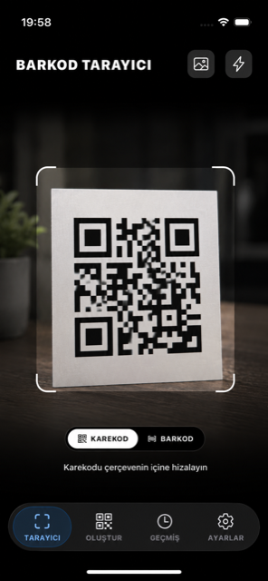
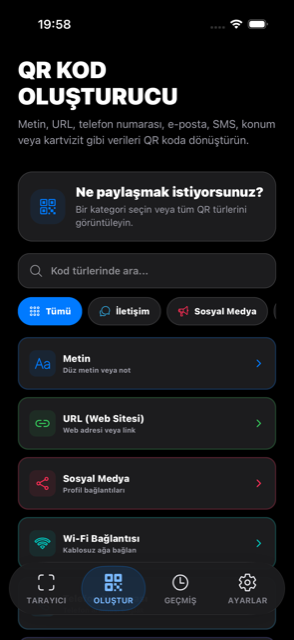
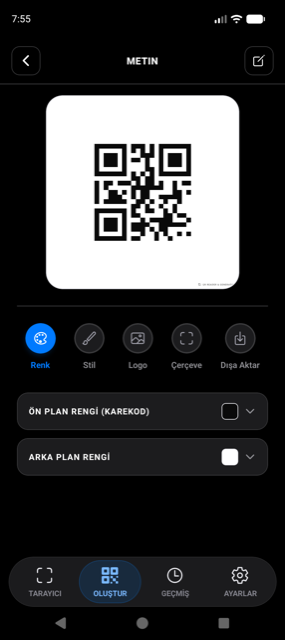
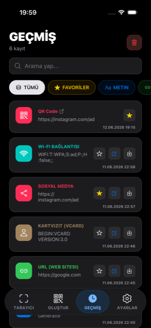
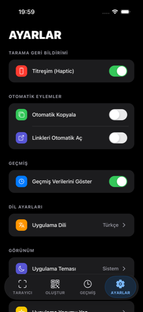

# Barkod Tarayıcı

### QR ve barkodları oku, kendi tasarımınla oluştur, paylaş.

QR kodları ve barkodları kamerayla ya da galeriden saniyeler içinde okuyan;
renk, logo, stil ve çerçeveyle gerçekten kişiselleştirilebilen bir QR kod
oluşturucu. Reklam yok, takip yok, çevrimdışı çalışır.

🌐 **[Tanıtım sitesi](https://kayaonur607.github.io/Barcode-Application/)** &nbsp;·&nbsp; 📱 **[App Store](https://apps.apple.com/app/id6778129852)**

---

## Ekran Görüntüleri

| Tarayıcı | Oluşturucu | Tasarım | Geçmiş | Ayarlar |
|:---:|:---:|:---:|:---:|:---:|
|  |  |  |  |  |
| Kamera/galeriden okuma | 21+ hazır içerik türü | Renk · stil · logo · çerçeve | Arama, favori, filtre | Tema, dil, otomatik eylemler |

---

## Neler yapabilir?

- **Hızlı tarama** — Uygulama açıldığında kamera hazır. QR ve barkod arasında tek dokunuşla geçiş, galeriden fotoğraf okuma, karanlıkta fener desteği.
- **21+ hazır içerik türü** — Wi-Fi, kartvizit (vCard), konum, etkinlik, IBAN, WhatsApp ve daha fazlası için doğru biçimi senin yerine hazırlar.
- **Gerçek anlamda özelleştirme** — Ön/arka plan rengi, nokta ve köşe stilleri, ortaya logo, çerçeve ve PNG/JPEG dışa aktarma.
- **Düzenli geçmiş** — Taradığın ve kaydettiğin kodlarda arama yap, favorile, filtrele; tek tek ya da topluca sil.
- **Sana uyan görünüm** — Türkçe/İngilizce arayüz, açık/koyu/sistem teması.

---

## Desteklenen içerik türleri

`Metin` · `URL` · `Wi-Fi` · `Telefon` · `E-posta` · `SMS` · `Kartvizit (vCard)` ·
`Konum` · `Etkinlik` · `Sosyal Medya` · `WhatsApp` · `Telegram` · `Zoom` ·
`Toplantı` · `App Store` · `IBAN` · `Kripto Para` · `PayPal` · `PDF` ·
`Dijital Menü` · `Google Yorum`

---

## Gizlilik

Verilerin cihazında kalır. Uygulama reklam göstermez, tarama ya da oluşturma
geçmişini hiçbir sunucuya göndermez. Tüm kayıtlar yalnızca cihazında yerel
tutulur ve istediğin an silebilirsin.

📄 [Gizlilik Politikası](https://kayaonur607.github.io/Barcode-Application/privacy.html) ·
[Destek & SSS](https://kayaonur607.github.io/Barcode-Application/support.html)

---

## Bu depo hakkında

Burada uygulamanın **tanıtım ve gizlilik sayfaları** (`docs/`) yer alır;
GitHub Pages ile yayınlanır ve `main` dalına yapılan her push'ta otomatik
güncellenir. Uygulamanın kaynak kodu bu depoda bulunmaz.

© 2026 Onur Kaya
